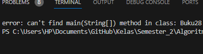
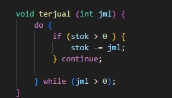
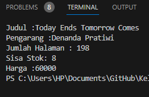
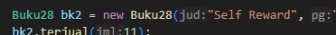
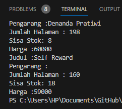

Nama : Varizky Naldiba Rimra  
Kelas : TI 1H  
Nim : 2341720243  

# Pertemuan 2 Praktikum Algoritma dan Struktur Data

## Percobaan 1 Deklarasi Class, Atribut dan Method

  

### Pertanyaan Percobaan 1

1. Sebutkan dua karakteristik class atau object! 
- Class  
 Blue print yang mendefinisikan atribut (variable)  
 Kerangka dasar dalam pembuatan objek 
- Object  
Setiap objek memiliki identitas  
Objek memiliki keadaan tersendiri tergantung variable nya  

2. Perhatikan class Buku pada Praktikum 1 tersebut, ada berapa atribut yang dimiliki oleh class Buku? Sebutkan apa saja atributnya!  
5 class yaitu judul, pengarang, halaman, stok, harga.  

3. Ada berapa method yang dimiliki oleh class tersebut? Sebutkan apa saja methodnya!  
4 method
- method Tampil Informasi
- method Terjual
- method Restock
- method Ganti Harga  

4. Perhatikan method terjual() yang terdapat di dalam class Buku. Modifikasi isi method tersebut sehingga proses pengurangan hanya dapat dilakukan jika stok masih ada (lebih besar dari 0)!  

  

5. Menurut Anda, mengapa method restock() mempunyai satu parameter berupa bilangan int?  
untuk mengidentifikasi jumlah yang di masukkan pengguna  

## Percobaan 2 Instansiasi Object, serta Mengakses Atribut dan Method

### Pertanyaan 

1. Pada class BukuMain, tunjukkan baris kode program yang digunakan untuk proses instansiasi! Apa nama object yang dihasilkan?  
 
  
Object yang dihasilkan adalah bk1 dan bk2  

2. Bagaimana cara mengakses atribut dan method dari suatu objek?  
- Atribut 
menggunakan sintaks "namaObjek.namaAtribut"  
- Method 
menggunakan sintaks ""namaObjek.namaMetode()"  

3. Mengapa hasil output pemanggilan method tampilInformasi() pertama dan kedua berbeda?

## Percobaan 3

### Pertanyaan 

1. Pada class Buku di Percobaan 3, tunjukkan baris kode program yang digunakan untuk mendeklarasikan konstruktor berparameter!
2. Perhatikan class BukuMain. Apa sebenarnya yang dilakukan pada baris program berikut?
3. Hapus konstruktor default pada class Buku, kemudian compile dan run program. Bagaimana hasilnya? Jelaskan mengapa hasilnya demikian!
4. Setelah melakukan instansiasi object, apakah method di dalam class Buku harus diakses secara berurutan? Jelaskan alasannya!
5. Buat object baru dengan nama buku<NamaMahasiswa> menggunakan konstruktor berparameter dari class Buku!