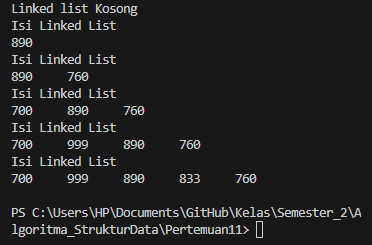

# Praktikum 10 Linked List
* Nama  : Varizky Naldiba Rimra
* Kelas : TI - 1H

## 2.1 Pembuatan Single Linked List
### 2.1.1 Verifikasi Hasil Percobaan

### 2.1.2 Pertanyaan
1. Mengapa hasil compile kode program di baris pertama menghasilkan “Linked List Kosong”?
> Karena tidak ada nilai pada list tersebut alias kosong
2. Jelaskan kegunaan variable temp secara umum pada setiap method!
> `temp`/ temporary digunakan untuk menunjukkan node sementara 
3. Perhatikan class SingleLinkedList, pada method insertAt Jelaskan kegunaan kode berikut

> kode tersebut digunakan untuk mengecek apakah node yang akan ditambahkan merupakan node terakhir. Dan jika iya, tail akan diubah jadi node baru
## 2.2 Modifikasi Elemen pada Single Linked List
### 2.2.1 Verifikasi Hasil Percobaan

### 2.2.2 Pertanyaan
