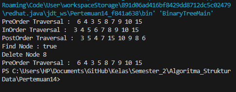
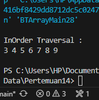

# 1
## Verifikasi Hasil

### Pertanyaan 
1. Mengapa dalam binary search tree proses pencarian data bisa lebih efektif dilakukan dibanding
binary tree biasa?
>
2. Untuk apakah di class Node, kegunaan dari atribut left dan right?
>
3. a. Untuk apakah kegunaan dari atribut root di dalam class BinaryTree?
>
b. Ketika objek tree pertama kali dibuat, apakah nilai dari root?
>
4. Ketika tree masih kosong, dan akan ditambahkan sebuah node baru, proses apa yang akan terjadi?
>
5. Perhatikan method add(), di dalamnya terdapat baris program seperti di bawah ini. Jelaskan
secara detil untuk apa baris program tersebut?
if(data<current.data){
if(current.left!=null){
current = current.left;
}else{
current.left = new Node(data);
break;
}
}
# 2 
## Verifikasi Hasil 

### Pertanyaan
1. Apakah kegunaan dari atribut data dan idxLast yang ada di class BinaryTreeArray?
2. Apakah kegunaan dari method populateData()?
3. Apakah kegunaan dari method traverseInOrder()?
4. Jika suatu node binary tree disimpan dalam array indeks 2, maka di indeks berapakah posisi
left child dan rigth child masin-masing?
5. Apa kegunaan statement int idxLast = 6 pada praktikum 2 percobaan nomor 4?