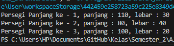
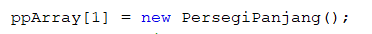
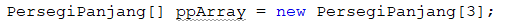
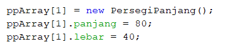
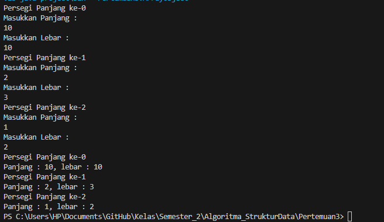
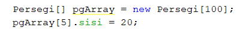
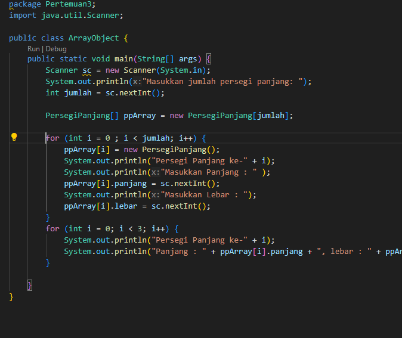
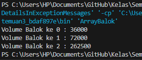
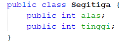

# Laporan Pertemuan 3 
Nama    : Varizky Naldiba Rimra
Kelas   : TI 1H
NIM     : 2341720243

## 3.2 Percobaan 1: Membuat Array dari Object, Mengisi dan Menampilkan
### 3.2.1 Langkah-langkah Percobaan
### 3.2.2 Verifikasi Hasil Percobaan


### 3.2.3 Pertanyaan
1. Berdasarkan uji coba 3.2, apakah class yang akan dibuat array of object harus selalu memiliki atribut dan sekaligus method?Jelaskan!
> Kode yang diberikan adalah contoh valid dari array of object. Class PersegiPanjang tidak memiliki method, tetapi hal tersebut tidak menjadi masalah karena kode tersebut hanya perlu mencetak nilai atribut. dalam beberapa kasus mungkin lebih baik memiliki atribut dan method, tergantung kebutuhan program yang di rancang.

2. Apakah class PersegiPanjang memiliki konstruktor?Jika tidak, kenapa dilakukan pemanggilan konstruktur pada baris program berikut :

> Class persegipanjang memiliki konstruktor, pada program merupakan pemanggilan konstruktor default class PersegiPanjang
3. Apa yang dimaksud dengan kode berikut ini:

> Kode tersebut untuk menginisialisasi atribut pada object, terdapat 3 persegi panjang yang tersimpan di ppArray[]
4. Apa yang dimaksud dengan kode berikut ini:

> pada kode program persegipanjang dengan panjang 80 dan lebar 40 akan disimpan di ppArray[1].
5. Mengapa class main dan juga class PersegiPanjang dipisahkan pada uji coba 3.2?
> Karena Encapsulation , konsep dalam OOP java. walaupun bisa di gabung class dan main di pisah agar main mudah di baca dan class persegipanjang bisa digunakan kembali oleh program lain

## 3.3 Percobaan 2: Menerima Input Isian Array Menggunakan Looping
### 3.3.1 Langkah-langkah Percobaan
### 3.3.2 Verifikasi Hasil Percobaan

### 3.3.3 Pertanyaan
1. Apakah array of object dapat diimplementasikan pada array 2 Dimensi?
> Array of object dapat diimplementasikan pada array 2 dimensi. Hal ini memungkinkan untuk menyimpan data yang kompleks dalam struktur data yang terstruktur.
2. Jika jawaban soal no satu iya, berikan contohnya! Jika tidak, jelaskan!
```
class PersegiPanjang {
  public int panjang;
  public int lebar;
}

public class Main {
  public static void main(String[] args) {
    PersegiPanjang[][] ppArray = new PersegiPanjang[3][2];

    ppArray[0][0] = new PersegiPanjang();
    ppArray[0][0].panjang = 110;
    ppArray[0][0].lebar = 30;

    ppArray[0][1] = new PersegiPanjang();
    ppArray[0][1].panjang = 80;
    ppArray[0][1].lebar = 40;

    ppArray[1][0] = new PersegiPanjang();
    ppArray[1][0].panjang = 100;
    ppArray[1][0].lebar = 20;

    ppArray[1][1] = new PersegiPanjang();
    ppArray[1][1].panjang = 90;
    ppArray[1][1].lebar = 50;

    // Mencetak nilai
    for (int i = 0; i < ppArray.length; i++) {
      for (int j = 0; j < ppArray[i].length; j++) {
        System.out.println("Persegi Panjang ke - " + (i + 1) + "," + (j + 1) + ", panjang : " + ppArray[i][j].panjang + ", lebar : " + ppArray[i][j].lebar);
      }
    }
  }
}
```

3. Jika diketahui terdapat class Persegi yang memiliki atribut sisi bertipe integer, maka kode dibawah ini akan memunculkan error saat dijalankan. Mengapa?

> karena kode program keliru harusnya 
```
pgArray[5] = new Persegi ();
pgArray[5].sisi = 20;
```
4. Modifikasi kode program pada praktikum 3.3 agar length array menjadi inputan dengan Scanner!

5. Apakah boleh Jika terjadi duplikasi instansiasi array of objek, misalkan saja instansiasi dilakukan pada ppArray[i] sekaligus ppArray[0]?Jelaskan !
> jika memiliki array ppArray yang berisi objek-objek Objek, dan melakukan ppArray[0] = new Objek() diikuti dengan ppArray[i] = ppArray[0], sekarang kedua indeks 0 dan i akan merujuk pada objek yang sama di memori. hal ini bermanfaat jika ingin mengakses objek yang sma pada program tanpa membuat salinan baru dari objek, namun duplikasi ini harus sesuai dengan logika yang terdapat pada program agar tidak terjadi error

## 3.4 Percobaan 3: Penambahan Operasi Matematika di Dalam Method
### 3.4.1 Langkah-langkah Percobaan
### 3.4.2 Verifikasi Hasil Percobaan

### 3.4.3 Pertanyaan
3.4.3 Pertanyaan
1. Dapatkah konstruktor berjumlah lebih dalam satu kelas? Jelaskan dengan contoh!
2. Jika diketahui terdapat class Segitiga seperti berikut ini:

Tambahkan konstruktor pada class Segitiga tersebut yang berisi parameter int a, int t yang masing-masing digunakan untuk mengisikan atribut alas dan tinggi.
3. Tambahkan method hitungLuas() dan hitungKeliling() pada class Segitiga tersebut. Asumsi segitiga adalah segitiga siku-siku. (Hint: Anda dapat menggunakan bantuan library Math pada Java untuk mengkalkulasi sisi miring)
4. Pada fungsi main, buat array Segitiga sgArray yang berisi 4 elemen, isikan masing-masing atributnya sebagai berikut:
- sgArray ke-0 alas: 10, tinggi: 4
- sgArray ke-1 alas: 20, tinggi: 10
- sgArray ke-2 alas: 15, tinggi: 6
- sgArray ke-3 alas: 25, tinggi: 10
5. Kemudian menggunakan looping, cetak luas dan keliling dengan cara memanggil method hitungLuas() dan hitungKeliling().

