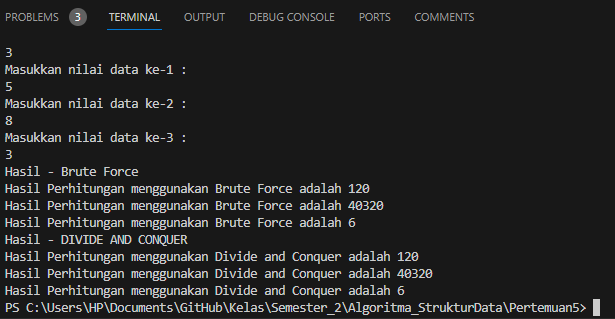
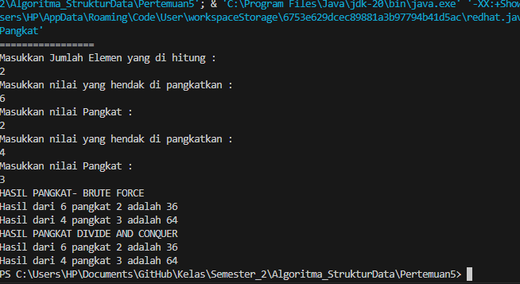
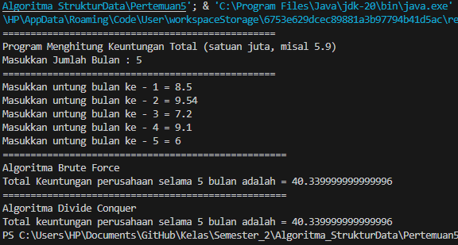
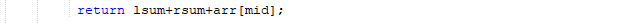

# JOBSHEET IV BRUTE FORCE DAN DIVIDE CONQUER
Nama = Varizky Naldiba Rimra
Kelas  = TI - 1H
## 4.2 Menghitung Nilai Faktorial dengan Algoritma Brute Force dan Divide and Conquer

### 4.2.3 Pertanyaan
1. Pada base line Algoritma Divide Conquer untuk melakukan pencarian nilai faktorial, jelaskan
perbedaan bagian kode pada penggunaan if dan else!
> perbedaan utama antara bagian kode yang menggunakan if dan else terjadi di dalam fungsi FaktorialDC(int n), Penggunaan 'if' Pada bagian ini, kita mengecek apakah nilai n sama dengan 1. Jika ya, maka kita langsung mengembalikan nilai 1 karena faktorial dari 1 adalah 1. Sedangkan Penggunaan 'else' Jika nilai n tidak sama dengan 1, maka kita akan melanjutkan proses perhitungan faktorial dengan menggunakan pendekatan Divide and Conquer.

2. Apakah memungkinkan perulangan pada method faktorialBF() dirubah selain menggunakan
for?Buktikan!
> Ya, memungkinkan untuk mengimplementasikan metode FaktorialBF() tanpa menggunakan perulangan for, bisa dengan menggunakan rekursif seperti berikut 
```
static int FaktorialBF(int n) {
    if (n == 0 || n == 1) {
        return 1;
    } else {
        return n * FaktorialBF(n - 1);
    }
}
```
3. Jelaskan perbedaan antara fakto *= i; dan int fakto = n * faktorialDC(n-1); !
> "fakto *= i" menggunakan metode Brute force yang dimana pada setiap iterasi, i bertambah satu dan fakto terus diperbarui dengan perkalian nilai sebelumnya dengan i sedangkan "int fakto = n * faktorialDC(n-1);" menggunakan Divede Conquer yang dimana pendekatan ini memecah masalah faktorial menjadi masalah yang lebih kecil dengan mengalikan n dengan faktorial dari n-1, dan terus berlanjut hingga mencapai kondisi dasar saat n adalah 1.

## 4.3 Menghitung Hasil Pangkat dengan Algoritma Brute Force dan Divide and Conquer

### 4.3.3 Pertanyaan
1. Jelaskan mengenai perbedaan 2 method yang dibuat yaitu PangkatBF() dan PangkatDC()!
> Pada pangkatBF setiap iterasi, basis a dikalikan dengan dirinya sendiri, sehingga mencapai hasil pangkat akhir setelah iterasi selesai sedanngkan pangkatDC membagi pangkat menjadi dua bagian yang sama besar, menghitung hasil pangkat setengahnya secara rekursif, dan menggabungkan hasilnya.

2. Apakah tahap combine sudah termasuk dalam kode tersebut?Tunjukkan!
3. Modifikasi kode program tersebut, anggap proses pengisian atribut dilakukan dengan
konstruktor.
4. Tambahkan menu agar salah satu method yang terpilih saja yang akan dijalankan menggunakan
switch-case!

## 4.4 Menghitung Sum Array dengan Algoritma Brute Force dan Divide and Conquer

### 4.4.3 Pertanyaan
1. Mengapa terdapat formulasi return value berikut?Jelaskan!

2. Kenapa dibutuhkan variable mid pada method TotalDC()?
3. Program perhitungan keuntungan suatu perusahaan ini hanya untuk satu perusahaan saja.
Bagaimana cara menghitung sekaligus keuntungan beberapa bulan untuk beberapa
perusahaan.(Setiap perusahaan bisa saja memiliki jumlah bulan berbeda-beda)? Buktikan
dengan program!