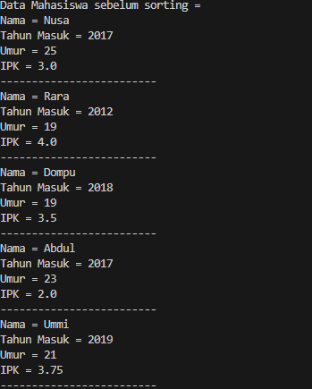
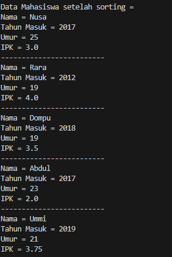

# Pertemuan 6
Nama    : Varizky Naldiba Rimra
Kelas   : TI - 1H
NIM     : 2341720343

## 5.2 Mengurutkan Data Mahasiswa Berdasarkan IPK Menggunakan Bubble Sort
### 5.2.2 Verifikasi Hasil Percobaan
> Sebelum Sorting

> Setelah Sorting

### 5.2.3 Pertanyaan
1. Terdapat di method apakah proses bubble sort?
2. Di dalam method bubbleSort(), terdapat baris program seperti di bawah ini:
Untuk apakah proses tersebut?
3. Perhatikan perulangan di dalam bubbleSort() di bawah ini:
a. Apakah perbedaan antara kegunaan perulangan i dan perulangan j?
b. Mengapa syarat dari perulangan i adalah i<listMhs.length-1 ?
c. Mengapa syarat dari perulangan j adalah j<listMhs.length-i ?
d. Jika banyak data di dalam listMhs adalah 50, maka berapakali perulangan i akan berlangsung? Dan ada berapa Tahap bubble sort yang ditempuh?

