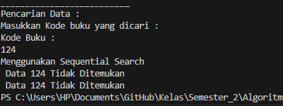
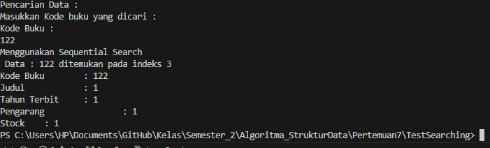
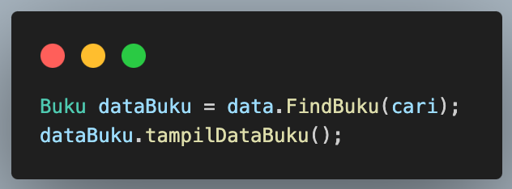

# Jobsheet VI Searching
- Nama    : Varizky Naldiba Rimra
- Kelas   : TI - 1H

## 6.2 Searching / Pencarian Menggunakan Agoritma Sequential Search

### Hasil Verifikasi Sequential Search

- Data Keseluruhan
> 
-  Pencarian Data Ditemukan
> 
- Pencarian Data tidak ditemukan
> 

#### 6.2.3. Pertanyaan
1. Jelaskan fungsi break yang ada pada method FindSeqSearch!
> untuk menghentikan perulangan for jika data yang dicari sudah ditemukan
2. Jika Data Kode Buku yang dimasukkan tidak terurut dari kecil ke besar. Apakah program masih dapat berjalan? Apakah hasil yang dikeluarkan benar? Tunjukkan hasil screenshoot untuk bukti dengan kode Buku yang acak. Jelaskan Mengapa hal tersebut bisa terjadi?
> 
- kode program masih bisa berjalan, akan tetapi data yang di 'searching' merupakan data yang teracak, karena data yang tersusun atau teracak     tidak mempengaruhi kode program. 
3. Buat method baru dengan nama FindBuku menggunakan konsep sequential search dengan tipe method dari FindBuku adalah BukuNoAbsen. Sehingga Anda bisa memanggil method tersebut pada class BukuMain seperti gambar berikut :
> 
- Method FindBuku
```
 Buku FindBuku(int cari) {
        for (int j = 0; j < listBK.length; j++) {
            if (listBK[j].kodeBuku == cari) {
                return listBK[j]; 
            }
        }
        return null;
    }
```
## 6.3 Searching / Pencarian Menggunakan Binary Search

### Hasil Verifikasi Binary Search
