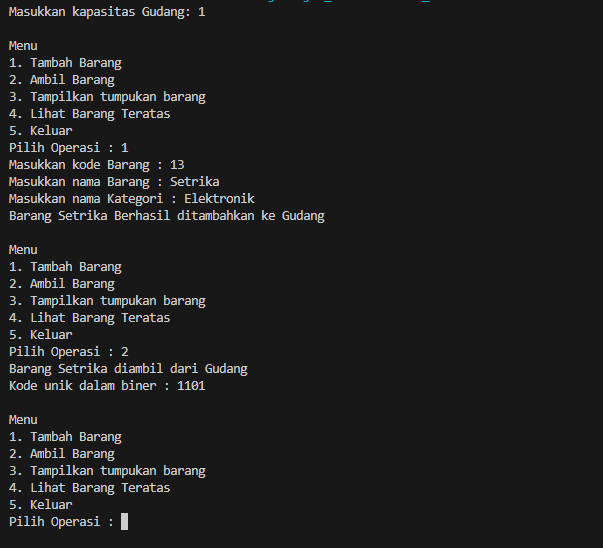

# Stacking

## 2.1 Percobaan 1: Penyimpanan Tumpukan Barang dalam Gudang
### 2.1.2 Verifikasi Hasil 

### 2.1.3 Pertanyaan
1. Lakukan perbaikan pada kode program, sehingga keluaran yang dihasilkan sama dengan verifikasi hasil percobaan! Bagian mana saja yang perlu diperbaiki?
> mengubah logika for pada method Tampildata();
```
for (int i = top; i >= 0; i--)
```
2. Berapa banyak data barang yang dapat ditampung di dalam tumpukan? Tunjukkan potongan kode programnya!
banyak data 
```
Gudang28 gudang = new Gudang28(7);
```
3. Mengapa perlu pengecekan kondisi !cekKosong() pada method tampilkanBarang? Kalau kondisi tersebut dihapus, apa dampaknya?
> Pengecekan kondisi !cekKosong() pada method tampilkanBarang() dilakukan untuk memastikan bahwa sebelum melakukan iterasi untuk menampilkan barang-barang di gudang, ada barang yang tersedia. Ini penting karena jika gudang kosong (tidak ada barang), maka tidak perlu melakukan iterasi karena tidak ada yang akan ditampilkan.
4. Modifikasi kode program pada class Utama sehingga pengguna juga dapat memilih operasi lihat barang teratas, serta dapat secara bebas menentukan kapasitas gudang!
```java
import java.util.Scanner;


public class Utama28 {
    public static void main(String[] args) {
        Scanner scanner = new Scanner(System.in);

        System.out.print("Masukkan kapasitas Gudang: ");
        int kapasitas = scanner.nextInt();
        scanner.nextLine();
        
        Gudang28 gudang = new Gudang28(kapasitas);

        while (true) {
            System.out.println("\nMenu");
            System.out.println("1. Tambah Barang");
            System.out.println("2. Ambil Barang ");
            System.out.println("3. Tampilkan tumpukan barang ");
            System.out.println("4. Lihat Barang Teratas");
            System.out.println("5. Keluar");
            System.out.print("Pilih Operasi : ");
            int pilihan = scanner.nextInt();
            scanner.nextLine(); 

            switch (pilihan) {
                case 1:
                    System.out.print("Masukkan kode Barang : ");
                    int kode = scanner.nextInt();
                    scanner.nextLine();
                    System.out.print("Masukkan nama Barang : ");
                    String nama = scanner.nextLine();
                    System.out.print("Masukkan nama Kategori : ");
                    String kategori = scanner.nextLine();
                    Barang28 barangBaru = new Barang28(kode, nama, kategori);
                    gudang.tambahBarang(barangBaru);
                    break;
                case 2:
                    gudang.ambilBarang();
                    break;
                case 3:
                    gudang.tampilkanBarang();
                    break;
                case 4:
                    gudang.lihatBarangTeratas();
                    break;
                case 5:
                    System.exit(0);
                    break;
                default:
                    System.out.println("Pilihan Tidak Valid, Coba Lagi");
            }
        }
    }
}

```
5. Commit dan push kode program ke Github

## 2.2 Percobaan 2: Konversi Kode Barang ke Biner
### Verifikasi Hasil

### 2.2.3 Pertanyaan 
1. Pada method konversiDesimalKeBiner, ubah kondisi perulangan menjadi while (kode != 0), bagaimana hasilnya? Jelaskan alasannya!
2. Jelaskan alur kerja dari method konversiDesimalKeBiner!

## 2.3 Percobaan 3: Konversi Notasi Infix ke Postfix

## 2.4 Latihan Praktikum